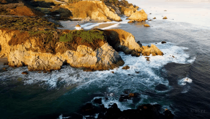

# currently under construction
## Video Deepfake Detection Prototype

Dataset source: Kaggle  
https://www.kaggle.com/datasets/kanzeus/realai-video-dataset

This project is a small prototype for testing a visual-odometry-style pipeline on real and AI-generated videos.



## Setup

From the repository root:

```powershell
python -m venv .venv
.venv\Scripts\activate
pip install -r requirements.txt
```

## Streamlit archive

The old Streamlit interface is archived for later reuse in:

```powershell
archives\streamlit
```

Archived launch options:

```powershell
python -m streamlit run archives\streamlit\app.py
```

or:

```powershell
archives\streamlit\launch_visual_odometry_app.bat
```

## Notebooks

- `notbook/Detection_DF.ipynb`  
  Test the pipeline on a single video or a single pair of frames.

- `notbook/opencv_test.ipynb`  
  Small ORB + essential-matrix pose-estimation notebook.

## Notes

- The first run may download the `LiheYoung/depth_anything_vitb14` model.
- Extracted frames are saved in `*_frames_spaced` folders or in the output folder chosen by the notebook or app.
- Depth cache files for the archived Streamlit app are stored in `archives/streamlit/depth_anything_cache/vitb`.
